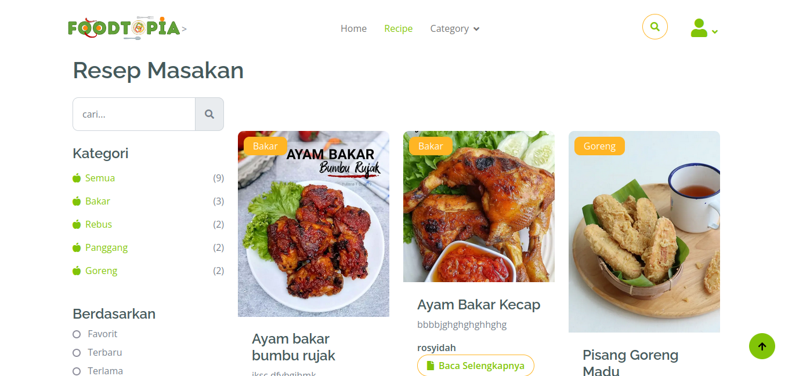

# 🥗 Foodtopia

**Foodtopia** adalah website resep masakan yang menyediakan berbagai resep makanan dan minuman untuk memudahkan pengguna menemukan inspirasi masakan sehari-hari. Website ini dirancang dengan tampilan sederhana namun menarik, cocok untuk semua kalangan.

---

## 📸 Tampilan Website




---

## 🚀 Fitur Utama

- 🔍 Pencarian resep dengan mudah
- 📋 Detail resep lengkap (bahan, langkah, gambar)
- 📱 Desain responsif untuk semua perangkat
- ❤️ Simpan resep favorit (jika ada fitur ini)

---

## ⚙️ Teknologi

- PHP Native
- HTML, CSS
- MySQL


---

## 📂 Cara Menjalankan Website

1. Clone atau download project ini.
2. Jalankan server PHP built-in:
   ```bash
   php -S localhost:8000
